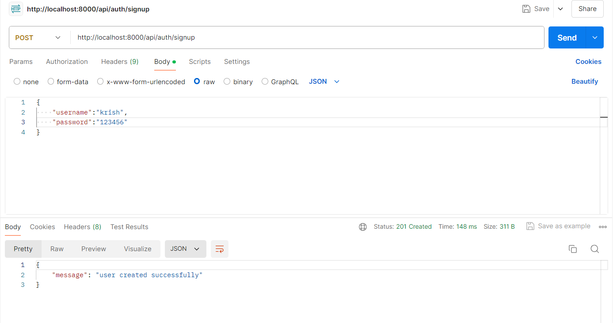
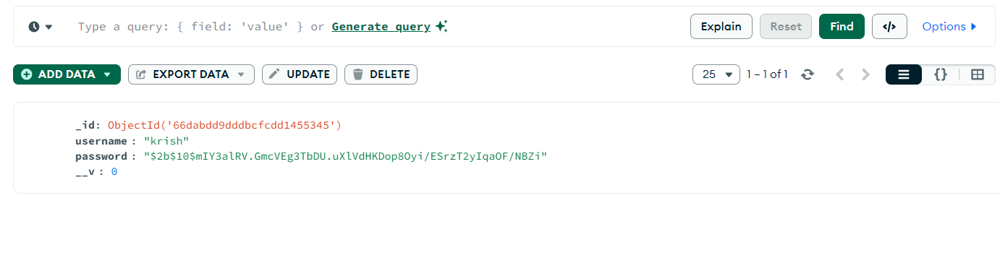
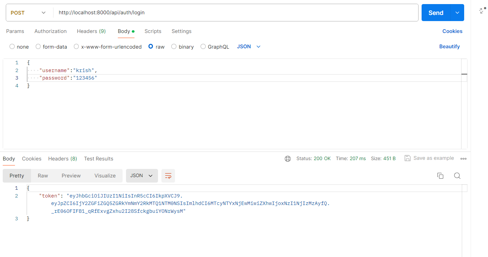
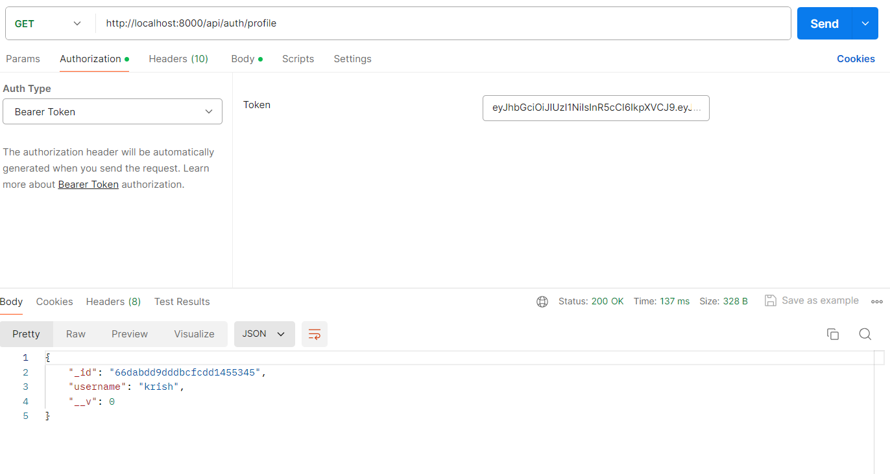
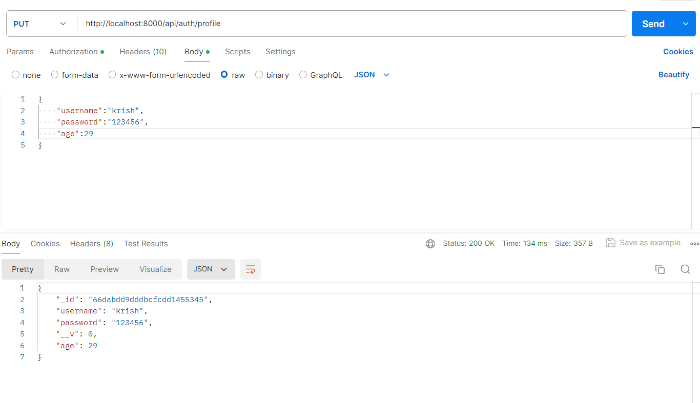

# User Authentication and Profile Management API

This project is a Node.js-based user authentication and profile management API built using Express, MongoDB, Mongoose, JWT for authentication, and bcrypt for password hashing.

## Features

- **User Signup:** Create a new user account with username and password.
- **User Login:** Authenticate user credentials and return a JWT token.
- **User Profile:** Fetch and update the user profile, with JWT-based authorization.
- **Password Security:** User passwords are securely hashed using bcrypt.
- **Token Authentication:** JWT tokens are used to secure protected routes.

## Technologies Used

- **Node.js:** Backend framework.
- **Express:** Web framework for Node.js.
- **MongoDB:** NoSQL database for data storage.
- **Mongoose:** ODM for MongoDB.
- **bcrypt:** Library for password hashing.
- **JWT:** JSON Web Token for authentication.
- **dotenv:** To manage environment variables.
- **CORS:** Middleware for enabling Cross-Origin Resource Sharing.
  

## API Endpoints

### Authentication Routes

**1.POST /api/auth/signup**

Create a new user account

```javascript
Request:
{
  "username": "exampleUser",
  "password": "examplePassword"
}

Response:
{
  "message": "user created successfully"
}
```






**2.POST /api/auth/login**

Authenticate user credentials and return a JWT token.

```javascript
Request:
{
  "username": "exampleUser",
  "password": "examplePassword"
}

Response:
{
  "token": "<jwt-token>"
}
```



### Profile Routes (Protected with JWT)

**1.GET /api/auth/profile**

Fetch user profile details. Requires Authorization header with Bearer token.

```javascript
Response:
{
  "_id": "userId",
  "username": "exampleUser",
  "age": 25,
  "dob": "1995-06-15",
  "contact": "1234567890"
}
```



**2.PUT /api/auth/profile**

Update user profile details.

```javascript
Request:
{
  "age": 26,
  "dob": "1995-06-15",
  "contact": "0987654321"
}

Response:
{
  "_id": "userId",
  "username": "exampleUser",
  "age": 26,
  "dob": "1995-06-15",
  "contact": "0987654321"
}
```



### Error Handling

- **401 Unauthorized:** If the JWT token is invalid or missing.
- **500 Internal Server Error:** If there are any server-side issues.


### Testing

Used Postman API testing tool to interact with the endpoints. Make sure to include the Authorization token (Bearer token) for protected routes.

---